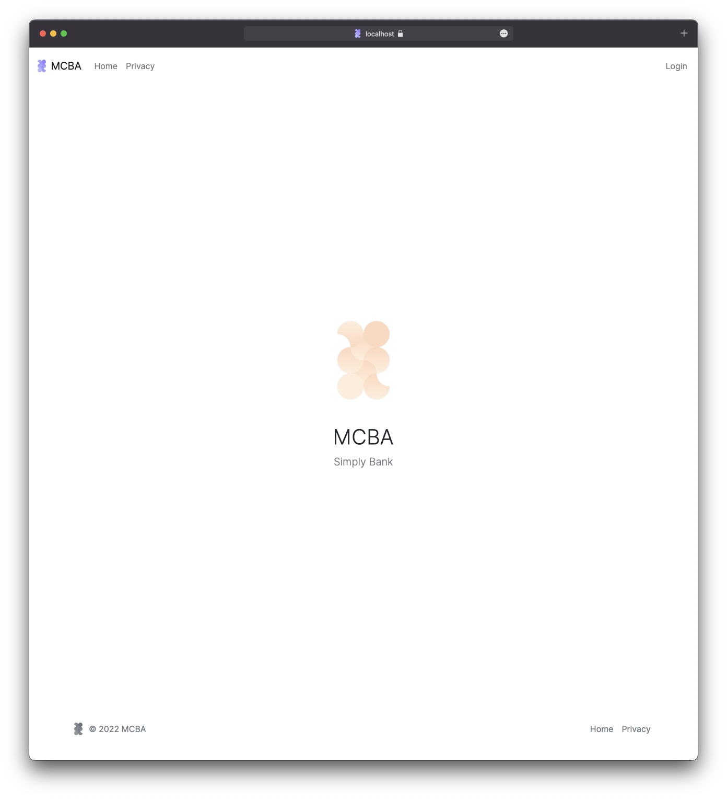
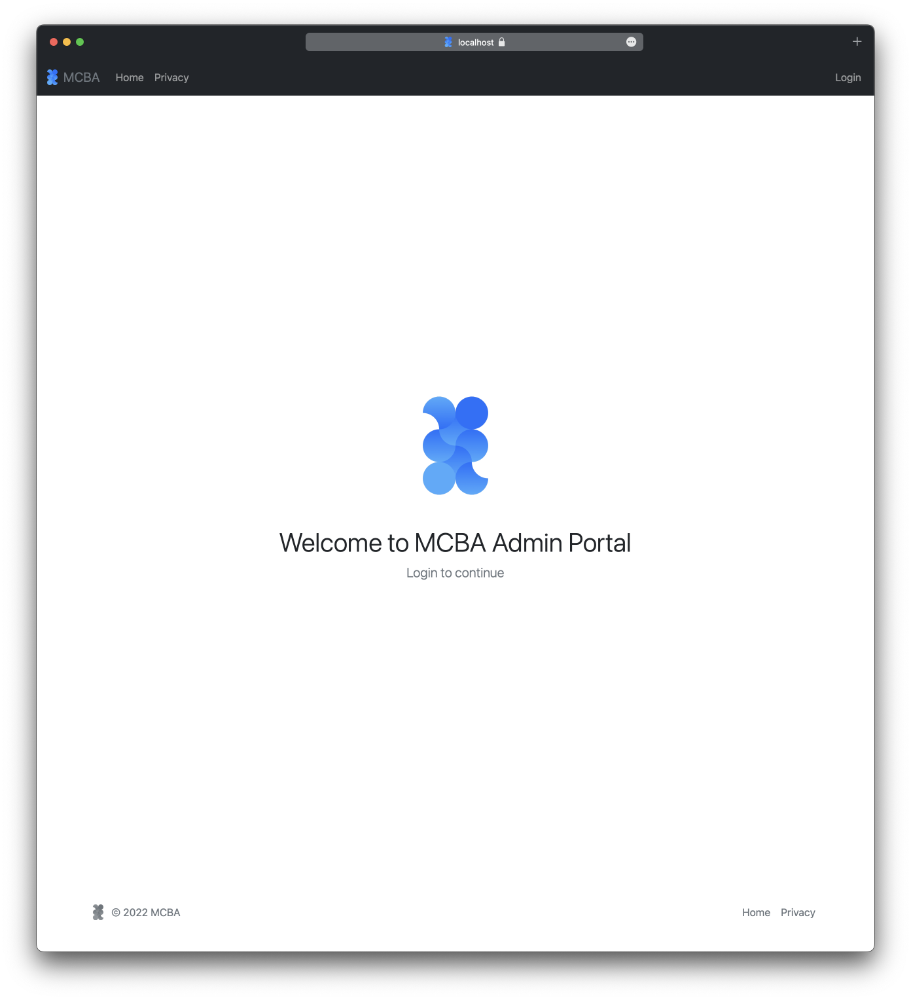

# MCBA Web App

## Arian Najafi Yamchelo - s3910902

**MCBA Customer Portal**

**MCBA Admin Portal**

## Links 

- [Trello](https://trello.com/b/FMz9G2Ve) Board
- [GitHub](https://github.com/rmit-wdt-sp2-2022/s3910902-a2) repository

## References

Docs.microsoft.com. 2022. Static files in ASP.NET Core. [online] Available at: <https://docs.microsoft.com/en-us/aspnet/core/fundamentals/static-files?view=aspnetcore-6.0> [Accessed 14 August 2022].

Edward, 2022. Logo not showing in navbar in ASP.net _layout.cshtml. [online] Stack Overflow. Available at: <https://stackoverflow.com/questions/55205625/logo-not-showing-in-navbar-in-asp-net-layout-cshtml> [Accessed 14 August 2022].

Google Fonts. 2022. Google Fonts. [online] Available at: <https://fonts.google.com/> [Accessed 14 August 2022].

Mark Otto, a., 2022. Get started with Bootstrap. [online] Getbootstrap.com. Available at: <https://getbootstrap.com/docs/5.2/getting-started/introduction/> [Accessed 14 August 2022].

Mdbootstrap.com/. 2022. Bootstrap center div vertically and horizontally. [online] Available at: <https://mdbootstrap.com/snippets/jquery/mdbootstrap/879783> [Accessed 14 August 2022].

